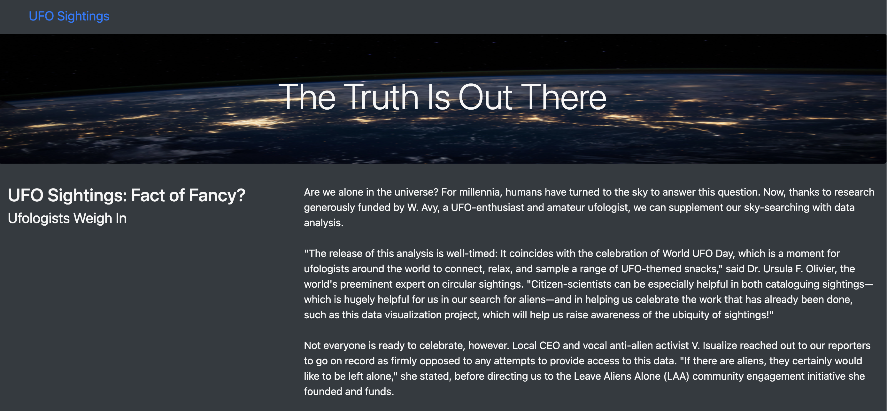

# UFOs
Javascript and Bootstrap

## Resources
- static/js/app.js
- static/js/data.js
- index.html
- nasa.jpg
--------------
- Javascript
- VS Code
- CSS
- HTMl
- D3.js

## Overview of Project:
The idea for this project was to create a javascript app that allows an html file to create a connection and display a filtered table with styling from CSS. This project is a demonstration in debugiing javascript code, using varying types of functions, using if-else statements, and creating forEach loops.

## Results:
The process to filter the table includes inputting a keyword in one of the available filters to filter the results to show the updated table. To reset the table, clear all the imputs from all filters. 

- Here we see the Landing page with the nasa.png in the header with a paragraph talking about whether UFO sightings are fact or fancy.

- Here we have imported the table from data.js to display the columns and the different options to filter the data.

- To filter the by a value in each column, you can insert the value that you would like filtered and pressing enter will update the table.

## Summary:
The outcomes of this assignment were that I was able to construct an index.html that can be used to display information discussing UFO's and filter the embedded data. One big drawback is that the data was limited and only included a limited couple of days, but this can be updated in the future with a new dataset. The webpage can be updated to include a better filtering option to filter on the comments section and duration of the data.
